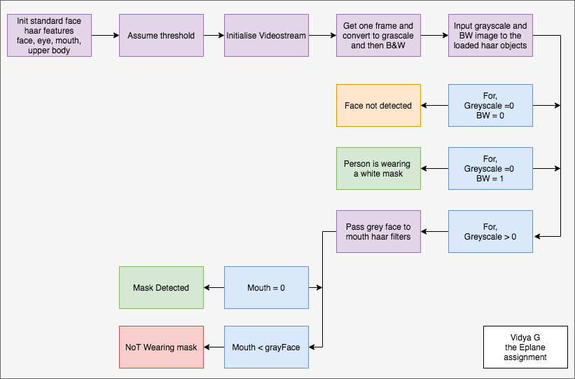
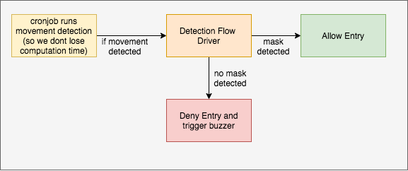
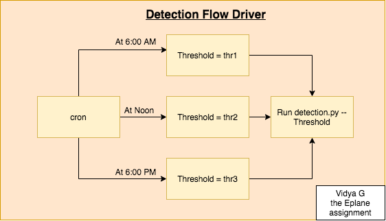

# Mask Detection
Our solution to this problem was bound to be in two ways. 
1. Costly Deep learning method
   1. Detect Face Using MTCNN.
   2. With the given bounding boxes from step 1 we input this to a mobilenet model to detect masks on the given co-ordinates.
2. Simple Opencv method
   1. Using Haarcascades on the given image we find the coordinates of a face 
   2. And in the given face co-ordinates we see if the mouth is present by contrasting it with mouth haar cascades pattern

### Implementation and Understandings

[Code Source](https://github.com/Shaligram1234/Python/tree/master/Face_Mask_Detection)

##### Object Detection -> Haar-features -> Face and Mask Detection using Haar-cascades
- Object detection by means of colour were the primitive means of object detection.
- An alternative was required for real-world applications.
- Now, Haar-features came into the picture. This considers adjacent rectangular regions at a specific location in a detection window, sums up the pixel intensities in each region and calculates the difference between these sums.
- We do this on a BW/gray pictures because it is redundant to calculate these features for three seperate channels and compare them. Also dropping these channels saves us alot of computation power and time by alteast 67% .
- Cascade classifier filters are xmls that have several hundred "positive" sample views of a particular object.
- So in haar-cascade classifier algorithm we try to correlate a moving window throughout the image so that it detects the object. 
- Here in our case, we run a moving window throughout the image comparing the haar-cascades of face and lips.
### Application System Design

- The edge device we implement our system on will have a buzzer and a cron service running in the background to see if there is any movement detected. The computation to detect movement either by proximity sensors or cv solutions is very much lesser compared to haar-cascade classification. So if we have this filter in our buffer it would enhance our system performance i.e we wont waste time finding a face in a blank image and when a person actually shows the response is relatively quick.
- If we have a high-compute edge device we could implement our model using MTCNN and mobilenet to detect masks with higher precision [using this as our reference](https://github.com/chandrikadeb7/Face-Mask-Detection). Because, the CV method has its own disadvantage to show variable performance benchmarks at varying light conditions.
- Or the solution to our varying light condition problem would be to have a cron set to trigger the detection flow with the threshold as different arguments at different times of the day. 
  

